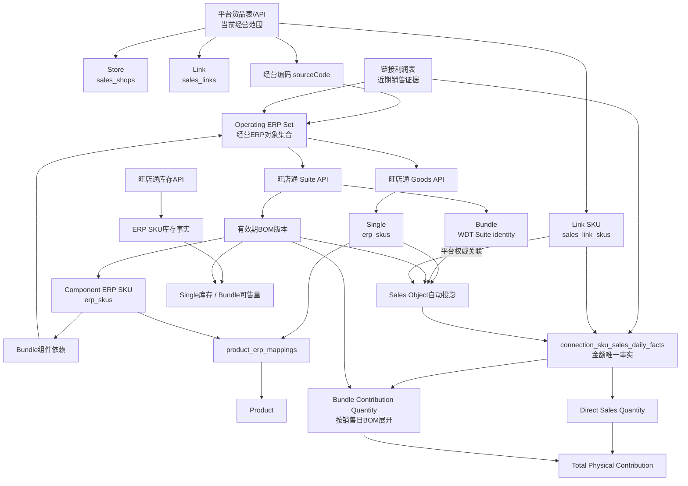

# 《Architecture Upgrade-003 V3最终数据模型与迁移方案》

生成时间：2026-08-21（Asia/Shanghai）
阶段性质：模型与迁移方案设计
实施状态：未修改代码、未修改数据库、未创建 Migration、未发布

## 一、结论摘要

V3 应把“正常商品关系的建立”改成来源驱动，而不是审批驱动：

1. 平台货品决定当前经营范围及 `Link → Link SKU → 经营编码`；
2. 旺店通 Goods/Suite API 决定编码是 Single 还是 Bundle，以及 Bundle 的 BOM；
3. 链接利润表只建立原始销售事实；
4. Sales Object 保留，但降级为上述权威数据的自动经营投影；
5. Product Structure 退出正式真相源，历史结构只读归档；
6. 人工流程只处理缺失、冲突和历史无法解释对象。

真实演练同时证明一个必须纠正的概念：旺店通 Bundle 父编码属于 Suite 命名空间。本次 3,479 个 Bundle 父编码在 `erp_skus` 中的命中数为 0。因此正式主链不能把所有 Bundle 父对象强行称为 `erp_skus` 记录。V3 使用统一的“经营 ERP 对象/销售对象编码”承接 Single 与 Bundle：Single 指向 `erp_skus`，Bundle 指向旺店通 Suite，并通过 BOM 指向组件 `erp_skus`。

最终回答：**V3 正式迁移完成后，正常商品关系不再需要人工审批。** 该结论来自真实数据：平台关系无跨店 Link 冲突、无 Link SKU 编码冲突；2,690 个 Single 和 3,479 个 Bundle 可由旺店通识别；全部 3,479 个 Bundle 均有 BOM。人工审批只保留给异常对象。

## 二、V3总数据架构图

## 三、权威数据源表

| 数据对象 | 唯一权威来源 | 正式存储/投影 | 允许写入者 | 非权威资产处理 |
|---|---|---|---|---|
| Store、Link、Link SKU | 完整平台货品批次 | `sales_shops`、`sales_links`、`sales_link_skus` | 平台货品同步服务 | 手工档案只补展示信息，不改身份 |
| Link SKU经营编码 | 平台货品表/API | Link SKU来源字段 + Sales Object relation | 平台货品同步服务 | Legacy Mapping只读审计 |
| Single身份与ERP主档 | 旺店通 Goods API | `erp_goods`、`erp_skus`、类型观察记录 | 旺店通主档同步服务 | Excel主档只读兼容 |
| Bundle身份 | 旺店通 Suite API | `sales_objects(objectType=bundle)` 自动投影 | 旺店通Suite同步服务 | Excel Combo只作历史证据 |
| Bundle BOM | 旺店通 Suite API | `sales_object_structures`及components的有效期版本 | 旺店通Suite同步服务 | Product Structure只读归档 |
| ERP SKU到Product | `product_erp_mappings` | 原表 | Product Mapping正式入口 | 不由Sales Object反推 |
| 销售金额、成本、利润 | 链接利润表 | `connection_sku_sales_daily_facts` | 销售事实导入服务 | 旧周期事实只读 |
| 平台流量、支付、转化 | 平台经营数据 | `connection_period_snapshots` | 平台经营导入服务 | 不与ERP确认销售额合并命名 |
| 库存 | 旺店通库存API | ERP SKU库存事实表 | 库存同步服务 | Excel库存只读历史兼容 |

## 四、Operating ERP Set模型

### 4.1 定义

`Operating ERP Set = Platform Active ∪ Bundle Dependency ∪ Sales Active`

- Platform Active：最近一次成功完整平台货品批次出现的经营编码；
- Bundle Dependency：当前经营 Bundle 的有效 BOM 组件编码；
- Sales Active：在配置窗口内仍有真实销售，但最新平台货品批次未出现的经营编码；建议默认窗口 90 日，作为配置而非硬编码业务常量。

集合成员使用规范化编码去重：去首尾空格、统一大小写比较、保留原始展示编码。不能仅按数据库内部 ID 去重，因为 Bundle 在 `erp_skus` 中没有父记录。

### 4.2 建议Schema

新增轻量运行范围资产，不创建第二套商品主数据：

#### `operating_erp_set_members`

| 字段 | 建议 | 说明 |
|---|---|---|
| `normalizedCode` | PK | 统一编码身份 |
| `displayCode` | NOT NULL | 来源原始编码 |
| `salesObjectId` | nullable FK | 完成投影后关联 |
| `erpSkuId` | nullable FK | Single或Bundle组件时可关联 |
| `lifecycleStatus` | NOT NULL | active、active_dependency、sales_active、archived、external_unused、unresolved |
| `evidenceMask` | NOT NULL | platform/sales/dependency快速摘要 |
| `firstSeenAt` | NOT NULL | 首次进入经营集合 |
| `lastPlatformSeenAt` | nullable | 平台证据时间 |
| `lastSaleDate` | nullable | 最近销售日期 |
| `lastDependencySeenAt` | nullable | 最近BOM依赖时间 |
| `recalculatedAt` | NOT NULL | 最近重算时间 |
| `archivedAt` | nullable | 归档时间 |

#### `operating_erp_set_evidence`

保存集合来源证据，避免一个状态字段覆盖多个同时成立的原因：

`id, normalizedCode, evidenceType(platform_active/bundle_dependency/sales_active), sourceObjectType, sourceObjectId, sourceBatchId, validFrom, validTo, lastSeenAt, metadataJson`

唯一约束建议为“一个来源对象在同一有效期只有一条有效证据”。

### 4.3 生成、失效与恢复

1. 平台完整批次成功后重算 Platform Active；失败或部分批次不得使对象失效；
2. 当前有效 Bundle BOM 激活后重算 Dependency；
3. 每日销售事实提交后更新 Sales Active；
4. 三类证据全部失效后进入 Archived，不删除；
5. Archived 对象重新出现时复用原身份，新增证据并恢复相应状态；
6. 旺店通存在但没有三类经营证据的对象只在查询缓存中标记 External/Unused，不进入默认经营集合；
7. 对归档对象保留历史事实、BOM和Product追溯，不继续做日常库存与主档同步。

## 五、ERP生命周期模型

| 状态 | 判定 | 产品中心默认经营视图 | 库存同步 | 历史追溯 |
|---|---|---|---|---|
| Active | 最新完整平台批次直接销售 | 显示 | 是 | 是 |
| Active Dependency | 当前经营Bundle的组件 | 显示并标记“组合依赖” | 是 | 是 |
| Sales Active | 近期有销售，平台当前未出现 | 显示并标记“近期销售” | 是 | 是 |
| Archived | 无平台、无依赖、超出销售窗口 | 默认隐藏，可筛选 | 否；按需查询 | 永久保留 |
| External / Unused | 旺店通存在但无经营证据 | 不进入产品中心 | 否 | 仅保留API查询缓存/审计 |
| Unresolved | 有经营证据但API无法确认 | 异常列表显示 | 否，直到确认 | 保留来源证据 |

同一对象可以同时拥有多类证据，`lifecycleStatus` 取最高经营优先级：Active > Active Dependency > Sales Active > Archived。页面同时展示全部证据标签，不能用单一状态丢失原因。

## 六、Single / Bundle类型契约

### 6.1 权威规则

类型只能由旺店通确定：

- Goods API精确命中且Suite API不命中：Single；
- Suite API精确命中且Goods API不命中：Bundle；
- 两者都命中：`sku_type_conflict`，禁止自动激活；
- 两者都不命中：`erp_not_found`；
- API不可用：保持上一次确认类型，标记数据陈旧，不把类型改成未知；
- 从未成功确认且API不可用：Unresolved。

### 6.2 类型放置位置

不建议在 `erp_skus` 增加通用 `single/bundle` 字段。原因是实际 Bundle 父编码不属于 `erp_skus`。建议：

1. `erp_skus` 继续表示旺店通 Goods/Spec SKU；
2. `sales_objects.objectType` 保存自动投影后的经营类型；
3. 新增或复用同步日志保存类型观察证据：Goods是否命中、Suite是否命中、源更新时间、查询时间和原始引用；
4. `sales_objects` 增加 `typeStatus(confirmed/unresolved/conflict/stale)`、`typeConfirmedAt`、`sourceUpdatedAt`。

历史由Sales Object、Excel Combo或Product Structure推断出的类型只能作为迁移候选，不能直接标记 confirmed；必须经过旺店通复核。

## 七、Bundle BOM版本模型

### 7.1 是否新增独立ERP BOM层

建议**不新增第二套BOM业务表**，复用现有：

- `sales_object_structures`；
- `sales_object_structure_components`。

理由：现表已具备 Sales Object、version、structureHash、effectiveFrom/effectiveTo、source、状态及组件数量；且 Bundle 父不是 `erp_skus`，新建以父 `erpSkuId` 为外键的ERP BOM反而无法表达真实身份。

### 7.2 必要调整建议

| 当前约束 | 问题 | V3建议 |
|---|---|---|
| 激活结构必须 `reviewedBy/reviewedAt` | 正常API结构被迫人工审批 | 增加 `activationMode=source_verified/manual_exception`；source_verified无需人工审核 |
| `UNIQUE(salesObjectId, structureHash)` | A→B→A无法建立新历史版本 | 仅版本唯一；当前相同hash幂等，历史恢复允许新版本 |
| 只有 `sourceReferenceJson` | 查询源时间不稳定 | 增加 `sourceUpdatedAt`、`syncedAt` |
| active结构要求 `effectiveTo IS NULL` | 合理 | 保留；切换在同一事务关闭旧版并激活新版 |
| 组件唯一 `(structureId, erpSkuId)` | 合理 | 保留；同组件先按编码聚合数量 |

### 7.3 版本规则

1. 组件按规范化ERP编码排序，数量使用稳定小数格式，生成 `structureHash`；
2. 首次有效结构生成v1；
3. 同hash重复同步只更新 `syncedAt/sourceUpdatedAt`，不新增版本；
4. hash变化时在同一事务中关闭旧版 `validTo`、标记 superseded、生成并激活新版本；
5. A→B→A必须生成v3，不能复用v1；
6. 旺店通暂时不返回对象时，不立即删除当前BOM；先标记 source_missing_pending，连续成功完整查询仍缺失后转 inactive；
7. 删除后的历史版本永久可读；重新出现按新版本恢复；
8. 历史销售按 `saleDate ∈ [validFrom, validTo)` 选择BOM；若无匹配版本，产生 `bundle_bom_missing`，不得用当前结构强行解释。

## 八、Sales Object最终模型

### 8.1 正式定位

`Sales Object = 旺店通经营编码在经营系统中的标准销售投影`，不是独立结构真相源。

| 类型 | 自动投影 |
|---|---|
| Single | Goods API确认 → Sales Object(single) → `erp_skus ×1` |
| Bundle | Suite API确认 → Sales Object(bundle) → 当前有效WDT BOM组件 |

### 8.2 生成和修改规则

- 进入Operating ERP Set即触发身份查询；确认后按规范化编码幂等生成Sales Object；
- 同一规范化编码只允许一个当前Sales Object；
- Link SKU根据平台货品编码自动关联；
- API源字段和BOM只能由同步服务更新；
- 禁止人工创建正常Sales Object、人工修改类型或正常BOM；
- 人工只能处理异常决策，例如纠正来源编码、确认源冲突、补Product Mapping；
- 已确认类型发生变化时不原地静默覆盖：生成冲突记录，经源数据复核后关闭旧结构、建立新版本；
- 历史Sales Object ID和structure version永久保留，保证事实可追溯。

### 8.3 Link SKU关系

正式语义为：

`Link SKU → 平台经营编码 → Sales Object → (Single ERP SKU | Bundle BOM Components)`

因此文档中的简写 `Link SKU → ERP SKU → Sales Object` 只对Single成立。对Bundle，ERP经营编码是Suite code而不是 `erp_skus.id`。

`sales_link_sku_sales_object_relations` 继续承载有效期关系，来源必须是平台货品批次。正常自动关系不填写 `reviewedBy`；只有冲突处置记录人工信息。一个Link SKU同一时刻只能有一个active关系，一个Sales Object可被多个Link SKU复用。

## 九、Product模型

### 9.1 Single与组件

`erp_skus → product_erp_mappings → products` 继续作为Product唯一关系。一个ERP SKU最多一个Product Mapping，一个Product当前也保持现有一对一约束；未来若需要一产品多规格，应另立产品规格模型，不能在本次迁移中暗改。

### 9.2 Bundle

Bundle不映射为普通基础Product。产品中心保留两个明确入口：

- 单品档案：Products及其Single ERP SKU；
- 组合装档案：Sales Object(bundle)及当前/历史BOM。

组合装详情展示：Bundle编码、名称、BOM版本、组件Product、quantity、销售套数、销售额、利润、相关Link、可售量和源更新时间。若业务未来确需组合装经营档案，可扩展Sales Object展示字段，不创建伪Product Mapping。

## 十、Daily Facts正式模型

### 10.1 真实粒度修正

当前表唯一键为 `(salesLinkSkuId, erpSkuId, saleDate)`，且 `erpSkuId` 非空。这对Single成立，但不能准确表达真实Bundle父对象，因为Bundle父不在 `erp_skus`，利润表组件行也不能承担父销售金额身份。

V3目标经济事实粒度应明确为：

`saleDate + salesLinkSkuId + salesObjectId`

建议对 `connection_sku_sales_daily_facts` 做加法迁移：

- 新增 `salesObjectId`，完成回填与双写验证后设为必填；
- `erpSkuId` 仅作为Single直接ERP身份或原始行证据，不再作为Bundle父身份；
- `storeId/salesLinkId` 可由Link关系推导，不重复作为唯一身份；保留 `salesLinkId` 便于查询和历史防漂移，但必须校验属于同一Link SKU；
- 不把 `objectType`、当前BOM组件或Product ID写入事实；这些按销售日期从版本主数据解释；
- `factType` 扩展或增加业务分类，至少区分 commercial_sale、accounting_auxiliary、shipping_adjustment、other_adjustment；
- 保留sourceBatchId、sourceRowNumber、rawDataJson用于审计。

迁移期间不得修改历史金额。原有行先按 Link SKU有效期关系和销售日期回填Sales Object；无法唯一回填的行进入异常，不猜测。

### 10.2 金额唯一性

- 公司销售额、成本、利润只汇总Daily Facts；
- Bundle金额只属于Bundle Sales Object；
- BOM展开只产生物理贡献查询结果，不插入第二套金额事实；
- `0013/0016`等非商品事实进入明确财务类型，不进入Product关系治理；
- 相同源批次重复导入按正式唯一键幂等，发现内容变化时记录替换审计，不静默累加。

## 十一、Product贡献指标

| 指标 | 定义 | 金额处理 |
|---|---|---|
| Direct Sales Quantity | Product关联Single Sales Object的事实销量 | 可展示对应直接销售额/利润 |
| Bundle Contribution Quantity | Bundle套数 × 销售日有效BOM组件数量 | 不继承Bundle销售额/利润 |
| Total Physical Contribution | Direct + Bundle Contribution | 仅数量指标 |

每条Bundle Contribution必须可追溯到：Daily Fact ID、Sales Object ID、BOM Structure ID/version、Component ERP SKU、Product Mapping。BOM版本缺失或证据冲突时不输出伪精确数量，标记数据不足。

## 十二、金额、利润与平台指标口径

### 12.1 ERP确认经营口径

- 公司ERP确认销售额：Daily Facts `SUM(salesAmount)`；
- 公司ERP确认利润：Daily Facts `SUM(profitAmount)`；
- Bundle销售额/利润：按Bundle Sales Object汇总；
- Product直接销售额/利润：仅Single直接事实；
- Bundle对Product金额贡献：当前不分摊、不展示为Product销售额。

未来若确需分摊，必须建立独立、版本化且可解释的 `allocation_rule`，禁止临时按数量比例拆分。

### 12.2 平台指标口径

`connection_period_snapshots`继续作为平台经营表现真相源。页面统一使用：

- 平台支付金额（平台快照）；
- ERP确认销售额（Daily Facts）；
- ERP确认利润（Daily Facts）。

三者不得共同简称“销售额”，差异不自动视为错误，应展示日期范围和来源。

## 十三、库存模型

### 13.1 Single

读取旺店通ERP SKU仓库库存事实，产品库存由Product Mapping关联。

### 13.2 Bundle

本方案推荐 **B：按BOM组件计算Bundle可售量**，原因是Bundle父属于Suite而非 `erp_skus`，当前库存事实也以ERP SKU组件为身份。默认公式：

`Bundle Available = min(floor(Component Available / Component Quantity))`

若不能跨仓组装，应先在每个仓内计算最小值，再对允许履约的仓库求和；是否允许跨仓必须成为明确履约配置。

即使旺店通Suite API未来返回父库存，也只能作为“旺店通参考可售量”单列对比，未经业务确认不能与组件推算相加。正式上线前需由仓储负责人确认旺店通父库存语义以及跨仓规则；确认前组件推算值标注“理论可售量”。

库存同步范围：Active、Active Dependency、Sales Active；Archived和External/Unused默认不做日常同步，详情按需查询。

## 十四、平台货品批次与失效逻辑

### 14.1 完整批次保护

只有满足“目标平台/店铺范围明确、解析成功、完整性检查通过、批次正式提交”的完整批次，才可以使缺席对象进入失效流程。预览、失败、部分文件、单店补录不得把其他对象置为Inactive。

### 14.2 三层生命周期

| 层级 | 本批出现 | 本批缺失 | 仍有近期销售/依赖 | 最终无证据 |
|---|---|---|---|---|
| Link | Active | Pending Inactive | Sales Active | Archived |
| Link SKU | Active | Pending Inactive | Sales Active | Archived |
| 经营ERP对象 | Active | 由其他证据重算 | Dependency或Sales Active | Archived |

建议Pending Inactive至少等待下一次同范围完整批次再次缺失，或经过配置的观察期，再转Inactive/Archived。状态变化只关闭当前有效关系，不删除历史Link、Link SKU或事实。

## 十五、人工异常模型

建议复用统一同步异常能力并扩展标准类型，不建设新的“正常关系治理中心”。

| 类型 | 触发 | 推荐处理 |
|---|---|---|
| `missing_erp_code` | 平台Link SKU编码为空 | 回源平台或明确无商品关系 |
| `erp_not_found` | Goods/Suite均未命中 | 修正编码或补旺店通档案 |
| `sku_type_conflict` | Goods与Suite同时命中或类型反转 | 核对旺店通源身份 |
| `bundle_bom_missing` | Bundle无有效组件或历史日无版本 | 重试API/补历史版本 |
| `bundle_component_missing` | BOM组件无ERP档案 | 查询组件主档 |
| `product_mapping_missing` | 终端ERP SKU无Product | 建立Product Mapping |
| `relation_conflict` | 同一Link SKU同有效期多个编码 | 核对平台批次 |
| `source_conflict` | 平台、旺店通、历史证据不一致 | 以权威源为准并保留审计 |

每条异常必须包含：来源批次、对象类型/ID、规范化编码、检测规则、证据JSON、首次/最近发现时间、状态、推荐处理、关闭人/时间/说明和重新检测结果。关闭异常不直接修改主关系；修复来源后由同步流程重算。

## 十六、历史342个Excel Bundle迁移

对 `combo_master_excel` 的342个Bundle建立一次性迁移清单：

1. 导出原父编码、组件、数量、结构时间、关联Sales Object和历史销售范围；
2. 对每个父编码查询旺店通Suite；
3. 分类为完全一致、BOM变化、旺店通不存在、编码冲突、Component差异；
4. 完全一致：标记Excel结构已由WDT版本继承，原记录只读归档；
5. BOM变化：根据历史销售日期确定Excel结构是否应成为早期版本，不能用当前API覆盖历史；
6. 旺店通不存在：若有历史销售，保留为历史有效版本并停止当前经营；无历史证据时进入归档候选；
7. 编码/组件冲突：进入异常清单，不自动选择；
8. 完成逐项对账、历史日期解析和归档SHA后，停止Excel Bundle新增写入。

## 十七、Legacy分类与退出

| 资产 | V3定位 | 退出条件 |
|---|---|---|
| `sales_link_sku_erp_mappings` | 历史审计/影子比较 | 新关系覆盖稳定、无正式读写、归档可恢复 |
| Legacy Product Structure | 历史审计 | 历史BOM版本完成迁移、日期解析一致 |
| Product Structure审批 | 异常治理兼容 | 正常来源审批入口关闭；异常流程迁移完成 |
| Combo Group/历史Combo | 可退役 | 342个Excel结构分类完成并归档 |
| Manual Binding | 可退役 | 平台关系自动化覆盖、无正式写入 |
| Legacy Resolver | 诊断专用 | V3全量双读无减少/冲突后只保留离线工具 |
| `connection_sku_sales_facts` | 长期历史归档 | 不参与业务读写，不在本次删除 |

退出顺序：停止新增写入 → 双读影子 → 正式读取切换 → 只读观察期 → 可恢复归档 → 最后物理退役。禁止Big Bang删除。

## 十八、API同步模式调整

### 18.1 标准流程

1. 平台完整批次提交并生成Operating ERP Set候选；
2. 对新增、过期或源更新时间变化的经营编码做Goods/Suite精确查询；
3. Bundle命中后获取BOM，再把组件加入Dependency集合；
4. 缺失组件再查询Goods主档；
5. 同步Active/Dependency/Sales Active对象库存；
6. 记录水位、查询时间、源更新时间、原始响应引用和异常；
7. 幂等生成Sales Object、关系和BOM版本。

### 18.2 API不支持批量精确查询时

- 优先使用商家编码精确搜索；
- Suite接口按编码查询时遵循其“编码优先于时间”语义；
- Goods接口若只能分页/时间窗：先使用源更新时间水位拉取候选页，在本地按Operating Set过滤；
- 对Operating Set做持久化查询缓存，TTL按状态区分：Active短、Archived长、not_found需退避重试；
- 新平台编码立即单码查询，不等待夜间全量；
- 每周/月做低频完整审计，只用于发现源删除和缓存漂移，不把全量旺店通对象自动纳入经营系统；
- 遵守请求限速、重试退避和可恢复游标，失败不得清空现有主档/BOM。

## 十九、前端展示调整

### 产品中心

- 默认经营SKU视图包含Active、Active Dependency、Sales Active；
- Archived可筛选，External/Unused不进入产品中心；
- Product详情分开显示Direct Qty、Bundle Contribution Qty、Total Physical Contribution；
- 直接销售额和Bundle参与数量分栏，禁止把Bundle金额写成Product销售额；
- 组合装管理展示WDT来源、BOM版本/有效期、组件Product、理论可售量和源更新时间。

### 链接中心

- Link SKU详情展示平台权威经营编码、自动Sales Object、类型及来源状态；
- 正常对象不出现“待审批”；
- 仅异常显示处理入口；
- 平台支付金额、ERP确认销售额、ERP确认利润分列并标注周期。

### 管理员数据中心

- 展示Operating ERP Set统计、API水位、缓存新鲜度、BOM版本变化及异常记录；
- 保留历史批次和Legacy归档查询；
- 不提供手工改正常关系的快捷入口。

## 二十、数据库Schema建议汇总

| 资产 | 处理 | 关键变化 |
|---|---|---|
| `operating_erp_set_members` | 新增 | 经营集合当前状态与关键时间 |
| `operating_erp_set_evidence` | 新增 | platform/dependency/sales多来源证据 |
| `sales_objects` | 扩展 | typeStatus、typeConfirmedAt、sourceUpdatedAt；继续承载经营投影 |
| `sales_link_sku_sales_object_relations` | 复用 | 平台批次自动生成；保留有效期和唯一active |
| `sales_object_structures` | 调整 | source_verified自动激活、sourceUpdatedAt/syncedAt、允许A→B→A版本 |
| `sales_object_structure_components` | 复用 | 组件只能指向真实 `erp_skus`，quantity>0 |
| `connection_sku_sales_daily_facts` | 加法迁移 | 增加salesObjectId和正式业务fact分类；不改历史金额 |
| 统一异常表/现有同步异常 | 扩展 | 八类标准异常和重检闭环 |
| Legacy表 | 不立即删除 | 冻结写入、只读、归档、观察后退役 |

## 二十一、完整迁移阶段计划

### 21.1 变更边界矩阵

| 阶段 | 数据库变化 | 代码变化 | 需要Migration | 改变正式读取 | 改变正式写入 |
|---|---|---|---|---|---|
| Phase 1 | 新增Operating Set成员与证据表 | 集合生成、重算、只读查询 | 是，可回滚新增表 | 否，仅影子展示 | 只写新投影表 |
| Phase 2 | 扩展Sales Object类型证据字段/记录 | Goods/Suite分类与冲突检测 | 是，加法Migration | 初期否；验收后只读新类型 | 是，仅类型投影与证据 |
| Phase 3 | 调整BOM版本字段和约束 | WDT BOM版本同步、按日期解析 | 是，需重建相关唯一索引 | 先影子，后切BOM读取 | 是，新BOM只写版本表 |
| Phase 4 | 无新业务表，必要字段已在前期准备 | Sales Object自动投影 | 视前期字段完成情况 | 先双读，不立即切换 | 新投影写入；Legacy不停止 |
| Phase 5 | 复用关系表 | 平台批次自动建立/关闭有效期关系 | 通常否 | 灰度切到自动关系 | 写Sales Object relation；Legacy仍冻结前观察 |
| Phase 6 | 原则上无新事实表，可加查询索引 | Direct/Bundle贡献查询 | 索引如需则是 | 是，新增指标读取 | 否，不生成金额事实 |
| Phase 7 | 不修改事实金额；必要时扩展展示元数据 | 统一金额/平台指标口径 | 通常否 | 是，页面与Capability切口径 | 否 |
| Phase 8 | 更新Operating Set投影状态 | 生命周期重算、库存同步范围、默认视图 | 否 | 是 | 只写生命周期投影 |
| Phase 9 | 新增历史BOM版本和归档证据 | 342项迁移工具与校验 | 是，数据Migration需可重跑 | 完成前不切历史读取 | 只写新历史版本，不删Excel结构 |
| Phase 10 | 最终阶段才可能归档/退役Legacy Schema | 停写、停读、归档恢复工具 | 分步骤；DROP单独审批 | 是，正式读完全V3 | 是，Legacy正式写入归零 |

任何“改变正式读取/写入”的步骤都必须由独立Feature Flag控制，不与Schema创建同一时刻强制启用。

### 21.2 实施总表

| 阶段 | 目标 | 主要修改 | 数据影响 | 风险 | 回滚方式 | 验收标准 |
|---|---|---|---|---|---|---|
| Phase 1 | Operating ERP Set | 新增成员/证据表；平台、销售、BOM范围计算 | 只新增投影 | 完整批次误判失效 | Flag关闭，删除投影重算 | A∪B∪C数量可解释；失败批次不失活 |
| Phase 2 | 类型契约 | Goods/Suite双源识别、类型证据、Sales Object类型状态 | 扩展类型字段，不改旧关系 | API冲突/不可用 | 保留旧类型只读，关闭新类型读取 | Single/Bundle与实时复核一致；冲突不自动激活 |
| Phase 3 | BOM历史版本 | 调整structure激活与hash约束，API版本同步 | 新增BOM版本 | 历史有效期错误 | Flag回旧结构读取；保留所有版本 | 幂等、A→B→A、历史日期解析通过 |
| Phase 4 | Sales Object自动投影 | 自动生成Single/Bundle对象与结构 | 新增/更新投影 | 人工历史字段冲突 | 停止投影写入，旧对象不删除 | 正常对象无需审批；Resolver影子无减少 |
| Phase 5 | Link SKU自动关系 | 平台批次自动建立有效期关系 | 新增relation版本 | 部分批次错误关闭关系 | 按batch回滚关系有效期 | 一个Link SKU一个active；历史可追溯 |
| Phase 6 | Product贡献销量 | 新增按事实日期+BOM版本查询 | 不写第二金额事实 | BOM版本缺口 | 关闭新指标 | Direct/Bundle/Total可追溯；金额总额不变 |
| Phase 7 | 金额及平台口径 | 三类金额名称统一；停止组件金额分摊 | 不改事实金额 | 页面口径理解变化 | 恢复旧展示但保留新计算 | 公司销售额利润完全守恒；来源标注明确 |
| Phase 8 | 生命周期与默认视图 | 启用Active/Dependency/Sales Active/Archived | 更新投影状态 | 误归档导致页面缺失 | 重算集合，恢复上次状态快照 | 默认经营对象不丢；库存同步范围正确 |
| Phase 9 | 342个Excel Bundle迁移 | 逐项WDT对比、历史版本归档 | 新增历史版本/归档证据 | 历史销售解释错误 | 原Excel结构继续只读 | 342项全部分类；历史销售有对应版本 |
| Phase 10 | Legacy退出 | 停写、切读、观察、归档、再退役 | 不先删除数据 | 隐藏依赖 | 重新启用兼容读、从归档恢复 | 正式读写0依赖；全量回归与归档恢复通过 |

### 每阶段发布纪律

- 每阶段独立Migration、独立Feature Flag、独立备份和可逆发布；
- 先隔离库，再影子生产只读，再有限读取切换；
- 正式销售事实、金额、Product Mapping不做批量重写；
- 任何数量下降、Resolver减少、销售额/利润差异均阻断进入下一阶段。

## 二十二、最终验收总标准

V3完成必须同时满足：

1. 平台完整批次可稳定生成经营范围，缺席规则不会因失败批次误伤；
2. 旺店通是Single/Bundle与BOM唯一权威来源；
3. 正常Sales Object、Link SKU关系和BOM全部自动生成且幂等；
4. 历史销售按有效期BOM解释；
5. Product贡献数量可追溯，金额与利润不复制；
6. 平台支付金额、ERP确认销售额和利润清晰分离；
7. 库存不重复累计，Bundle可售量语义经业务确认；
8. 人工入口只处理八类异常；
9. 342个Excel Bundle全部分类并完成历史保护；
10. Legacy正式读写归零，归档恢复演练通过后才允许物理退役。

## 二十三、最终回答

> V3正式迁移完成以后，正常商品关系是否还需要人工审批？

**不需要。**

原因不是预设，而是由模型和真实数据共同推导：平台源可以唯一确定Link与Link SKU经营编码；旺店通可以权威确定Single/Bundle及BOM；Product Mapping已有独立正式关系；利润表只承担事实，不再反推商品关系。正常链路应由权威来源自动、幂等、版本化生成。

仍需人工处理的只有：ERP编码缺失、ERP不存在、类型冲突、BOM/组件缺失、Product Mapping缺失、关系冲突和来源冲突。人工处理的是异常及其来源，不是替正常数据重复建关系。
