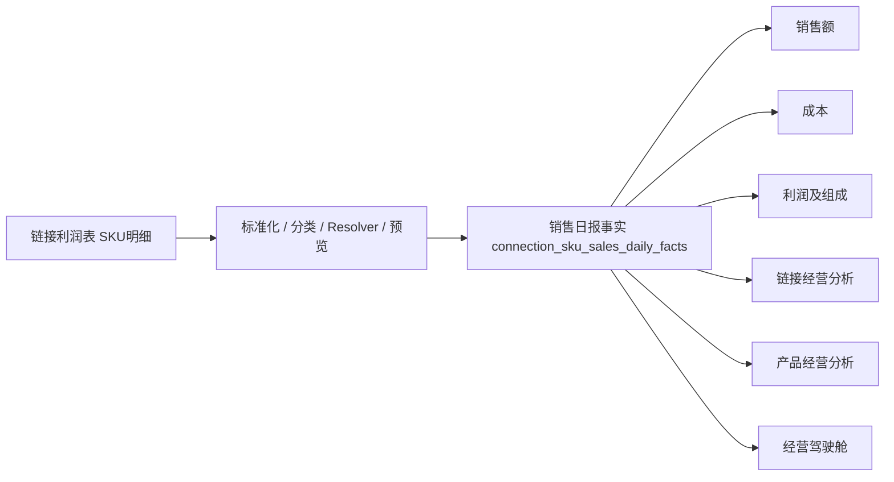

# V2-DATA-024 数据资产地图模块设计评估

## 1. 建设目的

数据资产地图用于回答四个问题：数据从哪里来、外部字段如何进入系统、形成了什么系统对象、被哪些业务能力使用。

它是现有数据契约的只读目录和血缘视图，不是新的同步引擎、关系真相源或治理中心。第一阶段不得复制业务数据，也不得让页面自行推导关系。

建议模块定位：

- 数据同步中心负责“执行同步”：任务、调度、预览、提交、批次、重试和异常记录。
- 数据资产地图负责“理解数据”：来源、字段契约、对象血缘、用途和覆盖情况。
- 业务关系仍由 Sales Object、ERP SKU、Product 等正式模型及 Resolver 解释。
- 数据问题只在地图中展示和定位；修复继续回到对应同步或正式业务流程。

## 2. 当前数据来源盘点

### 2.1 已接入的外部来源

| 数据源 | 来源方式 | 主要用途 | 当前处理方式 | 主要落点 |
|---|---|---|---|---|
| 平台货品表 | Excel，人工全量导入 | 建立店铺、平台商品、Link SKU 与销售对象编码身份 | `platformGoodsExcelDataSyncAdapter` 解析、精确匹配、预览、提交；不做模糊匹配 | `sales_links`、`sales_link_skus`、`sales_link_sku_erp_mappings`（兼容关系）、Sales Object 初始化输入、导入行与同步批次 |
| 平台经营数据表 | Excel，按平台模板导入 | 记录流量、浏览、收藏、加购、支付、转化及退款表现 | `connectionDataFoundationService` 按模板版本映射字段并生成周期快照 | `connection_period_snapshots`、`connection_import_batches`、模板与映射版本 |
| 链接利润表 / SKU 明细 | Excel，增量导入 | 记录按销售发生日归属的销量、销售额、成本、利润及利润构成 | `salesDailyFactPreviewService` 标准化、身份匹配、非商品分类、关系解析、预览后幂等提交 | `connection_sku_sales_daily_facts`；旧 `connection_sku_sales_facts` 仅兼容读取 |
| 组合装明细 | Excel，主数据生成输入 | 定义 bundle 销售对象的 ERP SKU 组件与 quantity | `salesObjectMasterDataService` 读取父编码、子编码和数量，与平台货品表共同生成 Sales Object 结构 | `sales_objects`、`sales_object_structures`、`sales_object_structure_components` |
| 旺店通货品档案 | API：`goods.Goods.queryWithSpec` | ERP Goods / ERP SKU 主数据、规格、条码、品牌、类目及图片 | `erpGoodsDataSyncAdapter` → `wangdianGoodsAdapter` → V2 导入预览和提交 | `erp_goods`、`erp_skus`、ERP导入批次及同步日志 |
| 旺店通平台货品 | API：`goods.ApiGoods.search` | 同步旺店通平台货品与系统店铺、链接、Link SKU 的身份关系 | `platformGoodsDataSyncAdapter` 调用平台货品同步服务，按店铺映射预览和提交 | `sales_links`、`sales_link_skus`、相关同步批次与异常 |
| 旺店通库存 | API：`wms.StockSpec.search2` | ERP SKU 仓库库存、可发库存、成本和库存日汇总 | `inventoryDataSyncAdapter` 精确按 `spec_no` 匹配 ERP SKU，按业务日期幂等写入 | `erp_sku_warehouse_inventory_facts`、`erp_sku_inventory_daily_summaries` |

### 2.2 系统内部来源

| 数据源 | 来源方式 | 主要用途 | 当前处理方式 | 主要落点 |
|---|---|---|---|---|
| 用户、组织、权限 | 管理员维护与登录 | 身份、数据范围和操作授权 | 资源接口及权限服务 | `persons`、部门、岗位、权限模板 |
| 产品档案 | 用户录入、ERP SKU 批量建档 | 产品经营档案、生命周期和营销资产 | 产品中心服务；ERP SKU 通过正式映射关联 Product | `products`、`product_erp_mappings` |
| 目标、关键行动、流程和任务 | 用户操作及流程生成 | 执行管理与工作结果 | 页面专用接口、流程引擎和任务服务 | goals、process、work plan、tasks 等表 |
| Link 经营档案 | 用户维护及平台数据补充 | 负责人、名称、图片、经营扩展信息 | 以 `sales_links` 为链接身份，`connection_profiles` 为经营扩展档案 | `sales_links`、`connection_profiles` |
| Sales Object | 平台货品表与组合装明细生成 | 表达平台实际销售单位及其 ERP SKU 组件 | 主数据生成、版本化结构、统一 Resolver | `sales_objects`、Link SKU关系、结构及组件表 |
| 同步运行元数据 | 同步服务自动生成 | 展示任务、批次、状态、进度、错误和审计 | 统一同步中心服务 | `data_sync_tasks`、`data_sync_batches`、`data_sync_logs`、`data_sync_exceptions` |

### 2.3 需要在地图中明确标记的兼容资产

- `connection_sku_sales_daily_facts` 是正式销售事实；`connection_sku_sales_facts` 应标记为 Legacy Read-Only。
- Sales Object 结构是销售对象组成关系；`sales_link_sku_erp_mappings` 和 Link Product Structure 只能标记为 Legacy/兼容资产，不应在地图中呈现为并列真相源。
- `connection_profiles` 不是链接身份；链接身份是 `sales_links`，前者只是经营扩展档案。
- 平台经营快照中的 `payAmount` 是平台经营指标，不应与日报事实 `salesAmount` 合并为同一个销售真相源。

## 3. 字段映射模型

### 3.1 已确认的核心映射

| 来源 | 来源字段 | 系统字段 / 对象 | 业务含义 | 状态 |
|---|---|---|---|---|
| 平台货品表 | 店铺 | `sales_shops` 身份匹配、`sales_links.shopId` | 平台店铺身份 | 已确认，精确匹配 |
| 平台货品表 | 货品ID | `sales_links.platformGoodsId` | 店铺内平台商品身份，不是系统 Link 主键 | 已确认 |
| 平台货品表 | 规格ID | `sales_link_skus.platformSkuId` | Link 下平台销售规格身份 | 已确认 |
| 平台货品表 | 平台规格编码 | `sales_link_skus.platformSkuCode`；Sales Object `objectCode/sourceCode` | 平台销售对象编码，可能是 single 或 bundle | 已确认 |
| 平台货品表 | 系统货品 | `sales_link_skus.systemGoodsType`；Sales Object `objectType` | 区分单品与组合装 | 已确认，值限定为单品/组合装 |
| 组合装明细 | 商家编码 / 父编码 | `sales_objects.objectCode`（bundle） | 组合销售对象身份 | 已确认 |
| 组合装明细 | 单品商家编码 / 子编码 | `erp_skus.merchantSkuCode` → structure component `erpSkuId` | bundle 的终端 ERP SKU 组件 | 已确认，精确匹配 |
| 组合装明细 | 数量 | `sales_object_structure_components.quantity` | 每销售一个 Sales Object 包含的组件数量 | 已确认；不得取销售数量代替 |
| 链接利润表 | 店铺 | `sales_shops` 精确匹配 | 销售事实的店铺身份 | 已确认 |
| 链接利润表 | 平台货品ID | `sales_links.platformGoodsId` → `salesLinkId` | 销售事实所属 Link | 已确认 |
| 链接利润表 | 平台规格ID | `sales_link_skus.platformSkuId` → `salesLinkSkuId` | 销售事实所属 Link SKU | 已确认 |
| 链接利润表 | 商家编码 | `erp_skus.merchantSkuCode` → `erpSkuId` | 源销售行出现的 ERP SKU 身份 | 已确认 |
| 链接利润表 | 日期 | `connection_sku_sales_daily_facts.saleDate` | 销售发生日期 | 已确认；导入时间只用于审计 |
| 链接利润表 | 销量/销售额/成本/利润 | `quantity/salesAmount/costAmount/profitAmount` | 正式销售事实指标 | 已确认 |
| 链接利润表 | 收入、退款、退货、邮费、费用等 | daily facts 对应利润构成字段 | 利润审计组成 | 已确认 |
| 平台经营表 | 商品ID / SPU | `sales_links.platformGoodsId` | 平台经营快照所属 Link | 已确认，按平台模板 |
| 平台经营表 | 统计日期 / 时间 | `periodStart/periodEnd` | 平台指标覆盖周期 | 已确认，支持字段或工作表名取日期 |
| 平台经营表 | 访客、浏览、收藏、加购 | snapshot 对应 count 字段 | 流量与互动指标 | 已确认 |
| 平台经营表 | 支付买家、支付件数、支付金额、转化率 | snapshot 对应 pay/conversion 字段 | 平台经营表现，不是正式销售事实 | 已确认，必须标明口径 |
| 旺店通货品API | `goods_no` | `erp_goods.goodsCode` | ERP货品编码 | 已确认 |
| 旺店通货品API | `goods_name` | `erp_goods.goodsName` | ERP货品名称 | 已确认 |
| 旺店通货品API | `brand_name/class_name/goods_type` | `brand/category/productType` | ERP货品属性 | 已确认 |
| 旺店通货品API | `spec_no` | `erp_skus.merchantSkuCode` | ERP SKU 唯一业务编码 | 已确认 |
| 旺店通货品API | `spec_name/barcode/spec_unit_name` | SKU规格、条码、单位 | ERP SKU基础属性 | 已确认 |
| 旺店通库存API | `spec_no` | `erp_sku_warehouse_inventory_facts.erpSkuId` | 库存所属 ERP SKU | 已确认，先精确匹配编码 |
| 旺店通库存API | `warehouse_id/no/name/type` | 仓库字段 | 仓库身份和属性 | 已确认 |
| 旺店通库存API | `stock_num/available_send_stock/cost_price` | 库存量、可发库存、成本价 | 库存事实指标 | 已确认 |

### 3.2 当前映射资产的真实存放方式

映射不是集中保存在一张表中：

1. 平台经营导入映射保存在 `connection_import_template_versions.fieldMappingsJson`，有版本和启停状态。
2. 平台货品和销售日报的核心字段映射当前固化在适配器的必填表头及字段常量中。
3. 旺店通 API 字段转换固化在 API Adapter 中。
4. Sales Object 关系通过正式实体、关系、结构和组件表表达，不属于“可任意修改的字段映射”。

因此地图的统一字段目录应是读取门面：把模板映射、代码契约和 Schema 元数据标准化展示。第一阶段不应创建另一套可执行映射。

### 3.3 推荐的字段目录展示模型

每条目录记录建议包含：

- sourceId、sourceVersion、sourceField、sourceFieldAliases；
- targetObject、targetTable、targetField；
- dataType、required、identityRole、metricRole；
- businessMeaning、valueRule、nullRule、unit；
- authorityLevel（authoritative / derived / audit / legacy）；
- runtimeOwner（模板版本、Adapter、Resolver 或 Schema）；
- status（active / legacy / disabled）；
- evidence（代码位置、模板版本ID、最近成功批次）。

“显示名称、业务说明、是否在地图中展示”可以作为说明元数据维护；不得以此启停核心身份关系或改变运行时字段映射。

## 4. 核心业务对象关系地图

### 4.1 财务与销售链路

规则：销售额、成本和利润的正式经营查询只读取 daily facts。平台经营快照的支付金额作为平台指标单独展示。

### 4.2 库存链路

### 4.3 地图节点和边的统计口径

- 节点数量直接使用对应正式表及有效状态统计，不在前端加载明细后计数。
- 边覆盖使用关系表的 active 状态和有效期统计。
- Sales Object → ERP SKU 必须读取 active structure 的 active components。
- ERP SKU → Product 只统计 active `product_erp_mappings`。
- 图上数量必须同时展示“统计时间”和“数据来源”，示例中的 8,182、6,365、2,958 只能作为界面示意，不能硬编码为生产值。

## 5. 模块页面设计

### 5.1 数据源管理

列表字段：数据源名称、来源类型、业务域、权威级别、执行方式、状态、最近成功时间、覆盖日期、最近批次、负责人。

详情展示：来源说明、同步任务、解析器版本、落点对象、字段数量、最近批次统计、异常摘要。操作仅允许跳转同步中心查看任务或批次，不在地图内启动同步。

### 5.2 字段映射管理

第一阶段只读，支持按来源、目标对象、状态和关键词筛选。详情按“来源字段 → 标准字段 → 系统对象字段 → 业务说明”展示，并标识真实运行位置。

第二阶段只允许维护：显示名称、业务说明、标签、责任人、是否在目录展示。任何影响解析的启停或字段目标变更必须进入同步规则版本流程，不能直接写核心关系。

### 5.3 数据关系图

提供三张预定义视图：链接到产品、销售与财务、ERP库存。节点点击后显示：对象说明、表名、主键、数量、有效数量、更新时间、上游来源、下游用途。边点击后显示：关系表、连接字段、基数、Resolver、覆盖率和 Legacy 状态。

不建议第一版做任意拖拽建模；应使用后端聚合后的固定 DAG，避免把展示图误当成关系配置器。

### 5.4 数据质量查看

只展示可解释的健康指标：

- 来源新鲜度：最近成功时间、业务日期、延迟状态；
- 结构覆盖：Link SKU 有 Sales Object 的数量与比例；
- 产品覆盖：终端 ERP SKU 有 Product 的数量与比例；
- 销售覆盖：商品销售总额与已写 daily facts 金额；
- 同步问题：失败批次、格式错误、身份缺失、关系缺失和真实冲突。

已解决、幂等跳过和历史异常默认折叠；非商品隔离不算商品覆盖缺失。页面只提供“查看来源批次/同步异常/业务详情”链接，不提供自动修复。

## 6. 权限设计

建议复用现有管理员权限体系，不新增面向普通员工的入口。

| 角色 | 权限范围 |
|---|---|
| 系统管理员 | 查看全部来源、字段、对象、血缘和技术证据；进入同步中心管理页面 |
| 数据管理员 | 查看业务来源、字段契约、覆盖率和异常摘要；第二阶段可维护说明元数据 |
| 开发维护人员 | 查看表、字段、Adapter、版本、批次和日志等技术证据 |
| 普通员工 | 默认不开放；业务页面继续展示与其职责相关的经营数据 |

权限至少拆分为 `dataAssetMap.view`、`dataAssetMap.viewTechnical`、`dataAssetMap.editMetadata`。同步执行仍使用同步中心原权限，不能由地图权限隐式获得。

## 7. 与同步中心的边界

| 能力 | 数据资产地图 | 数据同步中心 |
|---|---|---|
| 理解来源和字段 | 主责 | 提供运行证据 |
| 查看对象关系和用途 | 主责 | 不负责 |
| 查看覆盖率和新鲜度 | 汇总展示 | 提供批次状态 |
| 上传文件、调用API | 不执行 | 主责 |
| 预览、提交、重试、续跑 | 不执行 | 主责 |
| 修改核心映射或关系 | 不允许 | 通过正式版本化流程执行 |
| 处理业务关系 | 仅定位和跳转 | 也不直接处理，由正式业务流程承担 |

推荐采用引用而非复制：地图读取 `data_sync_tasks/batches/exceptions`、模板版本、Schema 与聚合查询；同步中心不依赖地图才能运行。

## 8. 实施顺序

### Phase 1：只读数据地图

- 建立后端只读 Capability，聚合来源目录、运行状态、字段契约和固定血缘图。
- 首批覆盖六个正式来源：平台货品Excel、平台经营Excel、销售日报Excel、旺店通货品API、平台货品API、库存API；组合装明细作为 Sales Object 主数据来源单列。
- 页面提供数据源、字段映射、关系图和质量摘要四个视图。
- 所有数量使用 SQL 聚合；详情按需加载；普通员工隐藏。

验收：与 Schema、模板版本、Adapter 常量和同步中心记录一致；不产生数据库写入。

### Phase 2：字段说明和目录元数据维护

- 允许维护显示名称、业务说明、标签、责任人和目录可见性。
- 建立元数据版本和审计，但不直接改变运行时映射。
- 核心字段或关系变更只能生成同步规则变更草案，并走独立审核。

验收：说明变更不影响任何导入、同步、Resolver 或事实结果。

### Phase 3：同步规则配置

- 仅在模板化来源中逐步支持字段规则版本配置、预览和回滚。
- API Adapter、身份规则和核心关系保持代码/契约管理，不能被通用表单任意改写。
- 配置发布后由同步中心执行，地图只展示生效版本和血缘变化。

验收：版本可追溯、预览可比较、失败可回滚、旧批次仍能按原版本解释。

## 9. 关键风险与控制

1. **把平台支付金额误认为正式销售额**：必须在对象和字段层标注口径与真相源。
2. **把 Legacy 关系显示成并列正式关系**：默认只画正式 Sales Object 主链，Legacy 放入兼容资产区域。
3. **字段目录与运行时漂移**：目录记录必须携带真实 Adapter/模板版本证据，并由自动检查发现漂移。
4. **前端计算数量或关系**：所有统计和血缘由后端聚合 Capability 返回。
5. **地图演变成治理中心**：第一阶段无修复按钮，只提供跳转和证据。
6. **通用字段编辑破坏核心身份**：Phase 2 仅编辑说明元数据，Phase 3 也必须版本化并受来源类型限制。

## 10. 最终建议

建议进入 Phase 1 只读数据地图设计细化。现有系统已经具备足够的数据源、同步批次、字段模板、Schema 和 Resolver 证据，不需要先新增业务表或重构同步链路。

第一版最小范围应是：一个管理员入口、四个只读视图、三张固定关系图，以及从地图跳转到现有同步任务和批次。暂不开放字段执行规则修改，也不建立独立治理体系。
