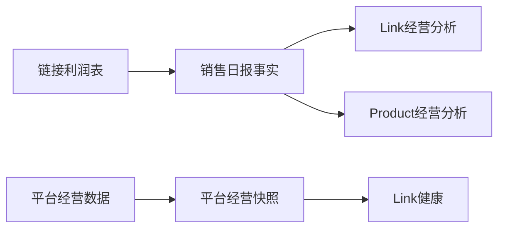
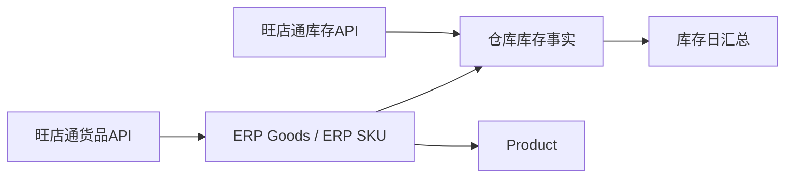

# V2-DATA-026 数据资产地图 MVP 设计评估

## 1. 模块定位

数据资产地图是面向管理者、数据管理员和开发维护人员的只读数据说明书。它把已存在的数据来源、字段契约、业务对象、正式关系和真相源状态集中展示，让使用者能够回答：

1. 一项数据从哪里来；
2. 外部字段进入了哪个系统字段；
3. 系统对象之间如何关联；
4. 哪个资产是正式真相源，哪些只是派生或历史兼容；
5. 当前资产有多少数据、最近更新到什么时候。

MVP明确不负责：

- 上传文件、调用API或执行同步；
- 修改字段映射、解析规则或同步计划；
- 创建或修改Link、Sales Object、ERP SKU、Product及其关系；
- 处理异常、补数据或自动治理；
- 通过可视化画布创建数据库关系；
- 替代数据同步中心、业务页面或管理员技术日志。

核心边界：地图解释已经存在的事实，不成为新的事实生产者。

## 2. 目标用户与典型问题

| 用户 | 主要问题 | MVP提供的答案 |
|---|---|---|
| 管理者 | 系统有哪些核心数据，经营数字以哪一套为准？ | 总览、核心对象、真相源标识、业务关系图 |
| 数据管理员 | 一个文件进入了哪些表，最近是否更新？ | 数据源详情、字段映射、落点对象、最近批次 |
| 开发维护人员 | 某对象的表、主键、上游、下游和Legacy替代关系是什么？ | 技术字段、关系边、Capability/Resolver和代码契约证据 |

普通员工不开放该模块。业务人员继续在产品中心、链接中心、财务中心和工作站使用业务结果，不需要理解底层表结构。

## 3. 入口与导航设计

### 3.1 推荐入口

在“系统设置”增加独立入口：

```text
系统设置
└── 数据资产地图
    ├── 数据总览
    ├── 数据源
    ├── 业务对象
    └── 关系地图
```

选择设置模块的原因：

- 它是系统级说明能力，不属于产品、链接、财务等单一业务域；
- 目标用户与设置/数据管理权限人群高度重合；
- 可以保持数据同步中心继续承担运行操作，避免用户误以为地图可以执行同步；
- MVP无需新增一级导航，降低信息架构和权限改造范围。

入口标题下固定显示说明：`只读查看数据来源、业务对象和真相源；数据同步与业务修改请前往对应模块。`

### 3.2 路由建议

保持现有hash路由风格，建议使用：

- `#settings/data-asset-map`：总览；
- `#settings/data-asset-map/sources`：数据源目录；
- `#settings/data-asset-map/sources/:sourceId`：数据源详情；
- `#settings/data-asset-map/objects`：业务对象目录；
- `#settings/data-asset-map/objects/:objectId`：对象详情；
- `#settings/data-asset-map/relations`：关系地图。

路由仅是设计建议。MVP实施时应复用设置模块现有加载方式，不为地图创建第二套路由系统。

## 4. 页面结构

### 4.1 数据总览

页面回答“系统有哪些数据资产，哪些是正式数据”。建议分为四区。

#### A. 数据源摘要

卡片展示：

- 文件导入来源数量；
- API同步来源数量；
- 系统内部来源数量；
- 最近成功更新来源数量；
- 有运行异常的来源数量。

数量口径：

- 文件、API和内部来源数量取自MVP版本化来源目录，不从批次表推断来源种类；
- 最近更新和运行异常取自 `data_sync_tasks/batches/exceptions` 及对应导入批次；
- 组合装明细等尚未进入统一同步任务的来源显示“按需导入/无统一调度”，不能显示为同步失败。

#### B. 核心业务对象摘要

首屏只展示管理者最需要理解的对象：

| 对象 | 数量口径 | 默认真相源状态 |
|---|---|---|
| Product | `COUNT(products)`，可同时显示按状态分布 | Source of Truth |
| ERP SKU | active与总量分别统计 `erp_skus` | Source of Truth |
| Link | active与总量分别统计 `sales_links` | Source of Truth |
| Link SKU | active与总量分别统计 `sales_link_skus` | Source of Truth |
| Sales Object | active及single/bundle分布 | Source of Truth |
| 销售日报事实 | 行数、日期范围、金额，不展示为“对象数量” | Source of Truth |

所有卡片显示统计时间；禁止硬编码历史数量。

#### C. 数据表结构摘要

展示：

- Schema表总数；
- 主数据表数量；
- 事实表数量；
- 关系表数量；
- 日志/批次表数量；
- 配置表数量；
- Legacy表数量。

分类来自V2-DATA-025冻结的目录清单。Schema表总数可以运行时读取SQLite元数据校验，分类数量从版本化目录聚合。若Schema出现未登记表，显示“目录待更新”，不自动猜测分类。

#### D. 真相源提示

用固定的业务口径卡明确显示：

- 正式销售事实：`connection_sku_sales_daily_facts`；
- 平台经营表现：`connection_period_snapshots`；
- ERP商品：`erp_goods` / `erp_skus`；
- ERP库存：warehouse inventory facts，日汇总为Derived；
- Link SKU销售对象关系：active Sales Object relation与active structure；
- Product档案：`products`；
- 财务流水：`finance_entries`；
- 工作结果：`tasks`结果字段。

该区域优先表达业务含义，技术表名作为次级信息。

### 4.2 数据源目录

列表字段：

- 数据源名称；
- 来源方式（File / API / Internal）；
- 所属领域；
- 权威级别；
- 更新方式（自动/人工、全量/增量/按需）；
- 最近成功时间；
- 覆盖日期；
- 当前状态；
- 主要落点对象。

支持按来源方式、业务域、状态和关键词筛选。MVP不提供新增、编辑、启停、同步、重试按钮。

首批目录至少包含：

1. 平台货品表；
2. 平台经营数据表；
3. 链接利润表/SKU明细；
4. 组合装明细；
5. 旺店通货品档案API；
6. 旺店通平台货品API；
7. 旺店通库存API；
8. 产品档案Excel；
9. 财务账单；
10. 系统用户录入与流程生成数据。

其他历史或辅助导入放在“更多来源”中，避免首页被技术入口淹没。

### 4.3 数据源详情

#### 基础信息

- 名称、来源类型、业务域、用途；
- 数据提供方和传输方式；
- 更新频率/调度说明；
- 全量/增量/按需模式；
- 当前状态、最近成功时间和最近业务日期；
- 解析器或模板版本；
- 主要落点对象及表；
- 运行证据来源。

#### 字段映射

表格结构：

| 外部字段 | 标准字段 | 系统对象/字段 | 业务解释 | 必填 | 角色 | 状态 |
|---|---|---|---|---|---|---|

“角色”区分身份字段、指标字段、日期字段、审计字段和辅助字段。

平台经营数据应按当前模板版本展示；核心Excel和API来源按Adapter已确认契约展示。代码中没有确认的字段不得由页面猜测。

#### 数据流向

显示只读小型血缘图：来源 → 解析/模板 → 系统对象 → 业务用途。例如：

```text
平台货品表
→ platformGoodsExcelDataSyncAdapter
→ Link / Link SKU / Sales Object身份
→ 链接中心、Resolver、产品关联
```

#### 最近运行

只显示最近一次批次的时间、状态、新增、更新、跳过、异常数量，并提供“前往数据同步中心查看记录”的普通链接。地图本身不处理异常。

对于没有统一批次的组合装明细，显示“当前由历史主数据生成流程提供运行证据”，而不是伪造最近同步时间。

### 4.4 业务对象目录

对象卡片按领域分组：

- 商品：Product、ERP Goods、ERP SKU、Sales Object、Link、Link SKU；
- 经营：销售日报事实、平台经营表现、库存事实、财务流水；
- 工作：目标、关键行动、任务、工作结果；
- 扩展：供应商、采购、客户、AI分析。

每张卡片展示名称、业务定义、正式表、记录数量、真相源标识和更新时间。列表按需加载，不读取对象全量明细。

### 4.5 业务对象详情

以Sales Object为例：

- 定义：平台实际销售单位，分single和bundle；
- 真相源状态：Source of Truth；
- 主表：`sales_objects`；
- 关系表：Link SKU relation；
- 结构表：structures/components；
- 主键和业务编码：`id`、`objectCode/sourceCode`；
- 数量：总量、active、single、bundle；
- 上游：平台货品表，bundle结构还依赖组合装明细；
- 下游：统一Resolver、组合装管理、Link详情、Product关联；
- 关键规则：一个Link SKU同一时点仅一个active Sales Object；销售金额属于Sales Object来源事实，组件不继承金额；
- Legacy替代关系：active mapping与旧Link Product Structure仅兼容。

所有对象详情使用统一结构：

1. 业务定义；
2. 真相源级别；
3. 技术实现；
4. 数量和有效状态；
5. 上游来源；
6. 下游用途；
7. 关键关系；
8. 口径与限制；
9. Legacy资产（如有）。

### 4.6 核心关系地图

MVP只提供固定DAG，不提供拖拽编辑。

#### 默认视图：商品销售链


节点展示：

- 业务名称；
- 当前数量及统计时间；
- 上游来源摘要；
- Source of Truth / Derived / Legacy标识；
- 是否存在详情入口。

边展示：

- 关系名称和方向；
- 基数（1:N、N:1等）；
- 正式关系表或Resolver；
- active覆盖数量/比例；
- 状态。

点击节点打开对象详情侧栏；点击边打开关系说明侧栏。侧栏只读且不展示“修复”“确认”“修改映射”操作。

#### 第二视图：销售与经营数据



必须突出：平台支付金额与销售日报销售额是两个不同口径。

#### 第三视图：ERP与库存



## 5. 真相源标识设计

### 5.1 三类主标识

| 标识 | 含义 | 视觉建议 | 示例 |
|---|---|---|---|
| Source of Truth | 当前业务对象或指标的正式权威资产 | 深绿色实心标识 | daily facts、Sales Object、ERP SKU、Product |
| Derived | 由正式数据计算或汇总，可重建 | 蓝色描边标识 | 库存日汇总、经营排行榜、财务报表查询结果 |
| Legacy | 历史兼容，仅限既有读取或审计，不允许成为新依赖 | 灰色/琥珀色标识 | 旧销售事实、旧Link Product Structure |

MVP可增加次级“Audit/Config”资产类型，但不能替代三类主状态：同步批次属于Audit，模板版本属于Config，它们不是业务真相源。

### 5.2 标识规则

- 标识在服务端目录定义中冻结，前端不得根据表名自动判断；
- Source of Truth必须同时说明业务范围，例如 `connection_period_snapshots` 是平台经营表现真相源，不是正式销售事实；
- Derived必须显示来源对象；
- Legacy必须显示替代资产和允许用途；
- 无法确认的资产显示“Unclassified/待目录确认”，不能默认标成Source of Truth。

## 6. 数据展示与交互原则

### 6.1 管理者模式与技术信息

同一页面采用分层信息：

- 默认显示业务名称、定义、数量、来源、用途和真相源状态；
- “技术信息”折叠区显示表名、主键、字段、Capability、Resolver和代码契约位置；
- 管理者不需要先阅读表名才能理解关系；
- 开发维护人员可以展开证据，但不能从地图执行写操作。

### 6.2 空数据与未知状态

- 记录数为0：显示“0”，并保留对象定义；
- 无权查看数量：显示“无权限”，不显示0；
- 尚无统一批次：显示“无统一运行记录”；
- 查询失败：显示“读取失败”，不回退到硬编码历史数量；
- 未分类资产：显示“待目录确认”。

### 6.3 性能原则

- 总览只请求聚合数字和少量状态，不读取125张表的明细；
- 数据源、对象列表服务端分页；
- 详情、字段映射、运行记录点击后按需加载；
- 关系图使用后端返回的固定节点/边摘要；
- Schema统计和相对稳定的目录定义可使用发布版本缓存；
- 批次状态、记录数和覆盖率实时查询，不混入静态目录缓存。

## 7. 权限设计

### 7.1 MVP权限

建议最小权限：

- `settings.viewDataAssetMap`：访问总览、业务说明和非敏感数量；
- `settings.viewDataAssetTechnical`：查看表名、字段、主键、Adapter、Capability和运行证据。

系统管理员默认拥有两项权限。数据管理员拥有查看地图权限，技术权限按岗位授予。普通员工默认关闭。

MVP不设计编辑权限，因为没有任何编辑能力。不得复用 `settings.managePermissions` 作为唯一查看条件，否则数据管理员会被迫获得权限管理能力。

### 7.2 数据范围

地图展示的是企业数据资产定义，不按个人数据范围裁剪对象目录；但运行数量可能包含企业级统计，因此仅面向获准角色。详情不返回人员密码、Token、原始账单、原始客户数据、附件内容等敏感记录。

## 8. 只读数据来源与Capability设计

### 8.1 设计原则

第一版不创建数据资产业务表。采用“版本化静态目录 + 动态聚合证据”组合：

- 静态目录：基于V2-DATA-025冻结数据源、业务对象、表分类、关系、定义和真相源状态，随代码版本发布；
- 动态证据：从现有Schema、同步任务/批次、模板版本和业务表聚合数量、日期范围、状态和覆盖率；
- 页面只调用只读Capability，不直接访问SQLite；
- Capability不得执行同步、修改配置或生成关系。

该方案避免第一阶段创建大量新表，同时防止前端硬编码统计和关系判断。

### 8.2 推荐Capability

#### `QueryDataAssetMapOverview`

返回：

```json
{
  "generatedAt": "ISO时间",
  "catalogVersion": "v1",
  "sourceSummary": {
    "file": 0,
    "api": 0,
    "internal": 0,
    "healthy": 0,
    "attention": 0
  },
  "objectSummary": [],
  "tableSummary": {
    "total": 125,
    "master": 0,
    "fact": 0,
    "relation": 0,
    "log": 0,
    "config": 0,
    "legacy": 0,
    "uncatalogued": 0
  },
  "truthSources": []
}
```

数字仅表示契约结构，实际返回必须实时计算。

#### `QueryDataAssetSources`

输入：`type/domain/status/keyword/page/pageSize`。

返回来源摘要、分页信息和最近运行状态。

#### `ReadDataAssetSource`

输入：`sourceId`。

返回基础信息、字段契约、落点对象、数据流向和最近运行摘要。

#### `QueryDataAssetObjects`

输入：`domain/truthSourceType/keyword/page/pageSize`。

返回业务对象摘要和动态数量。

#### `ReadDataAssetObject`

输入：`objectId`。

返回定义、正式表、核心字段、动态统计、上游、下游、关系、口径限制和Legacy替代说明。

#### `QueryDataAssetRelationGraph`

输入：`graphId`，首期仅允许 `product_sales`、`sales_operations`、`erp_inventory`。

返回固定节点和边：

```json
{
  "graphId": "product_sales",
  "generatedAt": "ISO时间",
  "nodes": [],
  "edges": [],
  "legend": []
}
```

### 8.3 现有数据来源映射

| 展示数据 | 读取来源 |
|---|---|
| Schema表清单 | `sqlite_master` / `PRAGMA table_info`，只读 |
| 表分类、业务定义、真相源状态 | 版本化数据资产目录清单 |
| 数据源运行状态 | `data_sync_tasks`、`data_sync_batches`、`data_sync_exceptions` |
| 平台经营字段映射 | active `connection_import_template_versions` |
| Excel/API固定字段契约 | 对应Adapter导出的只读契约或服务端catalog manifest |
| Product、ERP SKU、Link、Link SKU、Sales Object数量 | 对应业务表的SQL聚合 |
| Sales Object关系覆盖 | active Link SKU relation、active structure/components聚合 |
| Product覆盖 | active `product_erp_mappings` 聚合 |
| 销售事实范围 | daily facts数量、日期、销售额和利润聚合 |
| 库存范围 | warehouse facts和daily summaries聚合 |
| Legacy标识 | 版本化目录定义，不由记录数推断 |

## 9. MVP范围

### 9.1 必须实现

- 设置模块入口和只读权限；
- 数据总览；
- 数据源目录及详情；
- 业务对象目录及详情；
- 三张固定关系图；
- Source of Truth、Derived、Legacy标识；
- 动态数量、更新时间和来源证据；
- 跳转现有同步中心或业务详情的只读链接；
- 空数据、无权限、无运行记录和读取失败语义。

### 9.2 明确不实现

- 数据源新增、编辑、删除和启停；
- 上传、同步、重试、续跑和提交；
- 字段映射编辑；
- 关系创建、确认、修复或覆盖；
- 数据异常治理队列；
- 自定义关系画布；
- 任意SQL查询；
- 原始导入行和敏感数据浏览；
- 新数据库表和目录元数据管理后台。

## 10. MVP验收标准

### 功能

1. 管理员/数据管理员可进入，普通员工不可见；
2. 总览数量来自实时聚合，不硬编码；
3. 数据源详情能展示真实字段映射和最近运行证据；
4. 对象详情能说明定义、表、上游、下游和真相源；
5. 三张关系图可查看节点和边详情；
6. Legacy资产不会显示成正式真相源；
7. 页面没有上传、编辑、确认、修复或同步操作。

### 数据一致性

1. Schema表总数与SQLite元数据一致；
2. Product、ERP SKU、Link、Link SKU、Sales Object数量与数据库聚合一致；
3. 销售事实日期与金额来自daily facts；
4. 平台支付金额与销售事实金额分开展示；
5. Sales Object覆盖通过active关系和结构计算；
6. Legacy状态由冻结目录定义，不能因有数据自动升级。

### 性能与安全

1. 总览单次响应目标 `<500ms`，不读取业务明细；
2. 列表服务端分页，详情按需加载；
3. 关系图不产生N+1；
4. 所有API仅GET/只读Capability；
5. 不返回原始客户、财务、人员认证或附件内容；
6. 访问地图前后数据库内容完全不变。

## 11. 后续扩展

### Phase 2：目录说明元数据

可增加显示名称、业务说明、Owner、标签和可见性维护，但必须独立审计，且不能改变运行时同步或关系规则。

### Phase 3：字段契约版本比较

展示模板或Adapter版本差异、字段新增/删除、Schema漂移和影响对象。仍以查看和审核为主，不从地图直接执行生产变更。

### Phase 4：质量与血缘深化

增加字段级血缘、数据SLA、新鲜度趋势、覆盖率趋势和消费方清单。问题修复仍跳转到同步中心或正式业务流程。

不建议在数据资产地图中建设同步规则编辑器或治理工作台；如果未来确有配置需求，应作为同步中心的版本化能力独立设计。

## 12. 最终建议

数据资产地图MVP具备进入开发设计阶段的条件。最小实现应采用：设置模块内的管理员入口、六个只读Capability、版本化静态目录、动态SQL聚合、三张固定关系图。

第一阶段无需新增数据库表，也不应复用现有业务页面直接查询表。开发前建议先冻结MVP catalog manifest，明确首批数据源、对象、表分类、关系边和真相源状态，然后再实现只读服务和页面。

本阶段仅输出设计文档，不修改代码、数据库、同步逻辑或业务数据。
