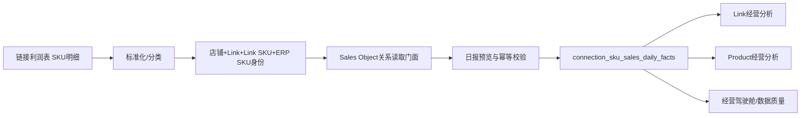
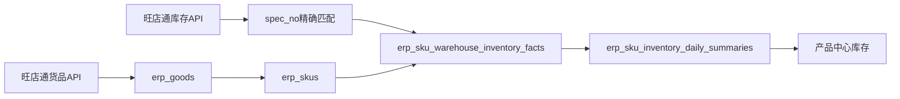
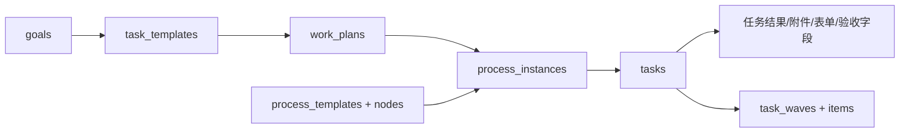

# V2-DATA-025 全系统数据资产目录审计

## 1. 审计结论

本目录基于当前源码、`server/schema.sql`、导入适配器、API同步服务和业务查询服务只读生成。Schema 当前定义 125 张表，覆盖组织权限、工作执行、商品、链接、销售、库存、财务、供应链、客户、同步审计和AI分析。

当前正式数据主链已经可以明确：

- ERP主数据：`erp_goods` / `erp_skus`；
- 平台链接身份：`sales_shops` / `sales_links` / `sales_link_skus`；
- 平台销售对象：Sales Object 四表；
- 产品档案：`products`，通过 active `product_erp_mappings` 关联ERP SKU；
- 正式销售事实：`connection_sku_sales_daily_facts`；
- 平台经营表现：`connection_period_snapshots`；
- 正式库存事实：ERP SKU仓库库存事实及日汇总；
- 财务流水：`finance_entries`；
- 工作结果：保存在 `tasks` 的结果、附件、提交表单和验收字段中，不存在独立“工作结果表”。

主要兼容风险是旧销售事实、旧Link SKU关系、旧Product Structure、历史手工绑定及快照资产仍在Schema中。目录必须把“正式、派生、兼容、日志”分开，不能因为表中存在数据就视为并列真相源。

## 2. 数据源目录

### 2.1 文件导入

| 数据源 | 来源方式 | 更新频率 | 业务用途 |
|---|---|---|---|
| 平台货品表 | Excel；统一同步任务 `platform_goods_excel_import` | 人工全量，按平台货品导出节奏 | 建立店铺、Link、Link SKU与平台销售对象编码身份；提供single/bundle类型 |
| 平台经营数据表 | Excel；按店铺和平台模板版本解析 | 日更或多日补录，人工增量 | 记录访客、浏览、收藏、加购、支付、转化、退款等平台表现 |
| 链接利润表（SKU明细） | Excel；销售日报预览与提交 | 日更、延迟导入和历史补录 | 写入按销售发生日归属的销量、销售额、成本、利润及利润组成 |
| 组合装明细 | Excel；Sales Object主数据生成输入 | 主数据变化时导入；当前未纳入统一调度任务 | 定义bundle销售对象的ERP SKU组件及每销售单位quantity |
| ERP货品档案Excel | ERP V2 Excel导入 | 人工全量/增量 | 在API不可用或历史导入场景更新ERP Goods、ERP SKU、规格和图片 |
| ERP库存Excel | ERP V2 Excel导入 | 人工日更/补录 | 兼容库存导入；正式自动来源为旺店通库存API |
| ERP平台货品Excel | ERP V2 Excel导入 | 人工全量/增量 | 兼容平台货品关系导入 |
| 产品档案Excel | 产品导入批次 | 按需 | 创建或更新Product经营档案及基础属性 |
| 财务账单 | Excel | 月度、周期或按账单导出 | 形成财务流水，按字段或规则分类收入、退款、成本、费用 |
| 链接负责人表 | Excel | 按需 | 批量匹配链接负责人，不改变Link身份 |
| 平台链接—店铺映射表 | Excel | 新店铺接入或身份修复时 | 将平台链接原始店铺身份精确关联到系统店铺 |
| 批量平台经营文件 | 多Excel批次 | 按需 | 批量执行平台经营数据模板解析和导入 |
| 生意参谋链接文件（历史入口） | Excel | 历史兼容 | 创建链接导入批次及经营快照；应逐步收口到统一平台经营导入 |
| 发布内容笔记表 | Excel/CSV/TSV | 按需 | 导入内容排期相关记录并匹配Product |
| 库存清仓任务表 | Excel | 按需 | 生成/辅助库存清仓工作流程，不属于库存事实来源 |
| 通用附件与图片 | 图片、文件、表格上传 | 用户操作触发 | 任务结果、产品图片、标准工作附件等非结构化资产 |

更新频率来自同步任务配置或业务入口语义；没有调度配置的来源统一标记“按需”，不推测固定周期。

### 2.2 API同步

| 数据源 | 来源方式 | 更新频率 | 业务用途 |
|---|---|---|---|
| 旺店通货品档案 | `goods.Goods.queryWithSpec` | 支持手工和自动增量；默认调度每天02:00但任务可暂停 | ERP Goods / ERP SKU正式主数据、品牌、类目、规格、条码、单位和图片 |
| 旺店通平台货品 | `goods.ApiGoods.search` | 支持手工和自动增量；默认调度每天02:30但任务可暂停 | 同步旺店通平台货品、店铺、Link与Link SKU身份关系 |
| 旺店通库存 | `wms.StockSpec.search2` | 支持手工和自动增量；默认调度每天03:00但任务可暂停 | ERP SKU仓库库存、可发库存、成本及日汇总 |

### 2.3 系统内部来源

| 数据源 | 来源方式 | 更新频率 | 业务用途 |
|---|---|---|---|
| 组织、用户与权限 | 管理员维护、登录 | 按需 | 身份、组织结构、角色和数据范围 |
| Product档案与营销资产 | 用户录入、ERP SKU批量建档 | 按需 | 产品生命周期、属性、图片及营销信息 |
| 目标、关键行动、流程、任务 | 用户操作、模板启动、流程引擎 | 实时 | 企业工作执行和验收闭环 |
| 工作结果 | 任务提交与验收 | 实时 | 结果文本、附件、表单、链接、提交与审核记录，存于任务记录 |
| Link经营档案 | 用户维护 | 按需 | Link负责人、名称、图片、关注、诊断和改善扩展信息 |
| Sales Object | 平台货品+组合装明细批量生成 | 主数据变化时 | 平台实际销售单位及其ERP组件结构 |
| 财务分类规则 | 管理员维护 | 按需 | 财务流水自动分类建议 |
| 模板、标准、表单和方法论 | 管理员维护和版本迭代 | 按需 | 关键行动、流程、任务与提交标准 |
| 同步任务、批次、日志和异常 | 同步框架自动生成 | 每次运行 | 数据同步审计、状态、错误和重试证据 |

## 3. 核心业务对象目录

### 3.1 商品体系

| 业务对象 | 系统名称 | 作用 | 核心字段 |
|---|---|---|---|
| Product | `products` | 企业产品经营档案，不等同于ERP SKU | `id`、`skuCode`、`name`、`brand`、`category`、`status`、图片和经营属性 |
| ERP Goods | `erp_goods` | 旺店通货品主档 | `id`、`goodsCode`、`goodsName`、品牌、类目、`currentState` |
| ERP SKU | `erp_skus` | 企业库存与货品规格身份 | `id`、`merchantSkuCode`、`erpGoodsId`、规格、条码、单位、状态 |
| Sales Object | `sales_objects` | 平台实际销售单位，分single与bundle | `id`、`objectCode`、`objectType`、`sourceCode`、`status` |
| Sales Object结构 | `sales_object_structures` + components | 版本化描述销售对象包含哪些ERP SKU及数量 | `salesObjectId`、`version`、`effectiveFrom/To`、`erpSkuId`、`quantity` |
| 店铺 | `sales_shops` | 平台店铺标准身份 | `id`、`platform`、`shopName`、`normalizedShopName`、`status` |
| Link | `sales_links` | 渠道经营单元和平台商品身份 | `id`、`shopId`、`platformGoodsId`、标题、URL、状态 |
| Link经营档案 | `connection_profiles` | Link的负责人、名称、图片等经营扩展 | `id`、`salesLinkId`、`ownerId`、`name`、`mainImage` |
| Link SKU | `sales_link_skus` | Link下面的平台销售规格 | `id`、`salesLinkId`、`platformSkuId`、`platformSkuCode`、规格、状态 |
| Product—ERP关系 | `product_erp_mappings` | 将ERP SKU归入Product档案 | `productId`、`erpSkuId`、`merchantSkuCode`、`currentState` |
| Link SKU—Sales Object关系 | `sales_link_sku_sales_object_relations` | Link SKU正式销售对象归属 | `linkSkuId`、`salesObjectId`、有效期、`status` |

### 3.2 经营体系

| 业务对象 | 系统名称 | 作用 | 核心字段 |
|---|---|---|---|
| 销售日报事实 | `connection_sku_sales_daily_facts` | 正式销售真相源 | `salesLinkId`、`salesLinkSkuId`、`erpSkuId`、`saleDate`、销量、销售额、成本、利润、来源批次 |
| 平台经营表现 | `connection_period_snapshots` | 平台流量、支付和转化表现 | Link、周期、访客、浏览、加购、支付买家、支付金额、转化率 |
| 库存仓库事实 | `erp_sku_warehouse_inventory_facts` | ERP SKU在业务日期和仓库下的库存事实 | `businessDate`、`erpSkuId`、仓库、库存、可发库存、成本价 |
| 库存日汇总 | `erp_sku_inventory_daily_summaries` | ERP SKU跨仓库存汇总 | 业务日期、ERP SKU、仓库数、库存、可发库存、库存成本 |
| 销售利润 | daily facts字段集合 | 销售事实内的金额及利润组成，不是独立表 | `salesAmount`、`costAmount`、`profitAmount`及收入/退款/邮费/费用字段 |
| Link健康记录 | `connection_health_records` | 记录基于平台快照形成的健康结果 | `connectionId`、`snapshotId`、分数、状态、问题和建议 |
| Link改善记录 | `connection_improvements` | 关联健康记录与关键行动前后指标 | Link、健康记录、行动、前后指标、结果摘要 |
| 产品健康与改善 | product health/issues/improvements | 产品问题、改善及策略记录 | `productId`、状态、指标、措施和时间 |

### 3.3 工作体系

| 业务对象 | 系统名称 | 作用 | 核心字段 |
|---|---|---|---|
| 目标 | `goals` | 企业和团队目标 | `id`、名称、负责人、周期、状态、进度、描述 |
| 关键行动标准 | `task_templates` | 可复用的行动标准及默认流程 | `id`、`businessCode`、名称、目标、负责人、状态 |
| 关键行动实例 | `process_instances` | 已发起关键行动及流程运行实例 | `id`、业务编码、模板、目标、负责人、状态、起止时间 |
| 流程模板与节点 | `process_templates` / nodes | 定义关键行动的标准步骤 | 模板ID、节点顺序、负责人规则、表单和完成标准 |
| 工作计划 | `work_plans` | 发起关键行动前的计划对象 | `id`、目标、行动标准、计划周、状态、流程实例 |
| 任务 | `tasks` | 可执行工作单元 | `id`、`businessCode`、名称、状态、执行人、期限、流程实例和节点 |
| 工作结果 | `tasks`中的提交字段 | 任务执行结果和验收证据 | `resultText`、附件、`submitFormData`、文件、链接、提交/审核字段 |
| 任务波次 | `task_waves` / items | 对任务进行波次收集、执行、提交和验收 | 波次编码、状态、任务成员、截止时间、结果草稿 |
| 周报与问题 | weekly report tables | 周度结果与问题记录 | 周期、人员、内容、问题、状态 |

### 3.4 财务体系

| 业务对象 | 系统名称 | 作用 | 核心字段 |
|---|---|---|---|
| 财务导入批次 | `finance_import_batches` | 财务账单预览、幂等和审计 | 文件、SHA、状态、总行数、匹配/待确认数量 |
| 财务流水 | `finance_entries` | 财务事实记录 | 业务日期、类型、科目、金额、说明、平台、Product、Link、外部单号 |
| 财务分类规则 | `finance_rules` | 根据关键词建议流水类型和科目 | 名称、关键词、类型、科目、优先级、状态 |
| 财务报表 | 查询结果，无独立报表事实表 | 聚合finance entries形成报表 | 周期、收入、退款、成本、费用及利润口径 |

> 客户中心和供应链中心已经正式退役。其专属客户、供应商、采购、供应商质量与评价表不再属于当前Schema；Product、ERP SKU、库存、成本、销售利润等共享资产继续由各自正式领域持有。

> 独立“AI经营助手”已经正式退役。生产 `ai_analysis_records` 为0行且无反向外键，已退出正式Schema；迁移只删除空表，其他环境如存在历史记录则自动保留为 Legacy Read-Only。产品健康分析、产品用户洞察、链接趋势与链接诊断继续由对应业务模块独立持有。

## 4. 数据表资产目录

### 4.1 主数据

| 表名 | 业务含义 | 所属领域 | 真相源状态 |
|---|---|---|---|
| `companies`、`departments`、`positions`、`persons` | 企业、组织、岗位、人员 | 组织权限 | 正式主数据 |
| `products` | Product经营档案 | 商品 | 正式经营主数据 |
| `product_marketing_assets` | Product营销信息 | 商品 | 正式扩展主数据 |
| `erp_goods`、`erp_skus` | 旺店通货品和规格 | ERP商品 | 正式主数据，来源旺店通 |
| `sales_shops`、`sales_shop_aliases` | 平台店铺及别名 | 链接 | 正式身份主数据 |
| `sales_links`、`sales_link_skus` | Link与平台销售规格 | 链接 | 正式身份主数据 |
| `connection_profiles` | Link经营扩展档案 | 链接 | 正式扩展主数据，不是Link身份 |
| `sales_objects` | 平台销售对象 | 销售对象 | 正式主数据 |

### 4.2 事实数据

| 表名 | 业务含义 | 所属领域 | 真相源状态 |
|---|---|---|---|
| `connection_sku_sales_daily_facts` | 按销售日期的SKU销售事实 | 销售 | 唯一正式销售事实 |
| `connection_sku_sales_facts` | 旧周期SKU销售事实 | 销售 | Legacy Read-Only |
| `connection_period_snapshots` | 平台经营周期表现 | 链接经营 | 平台表现真相源 |
| `erp_sku_warehouse_inventory_facts` | ERP SKU仓库库存事实 | 库存 | 正式库存明细真相源 |
| `erp_sku_inventory_daily_summaries` | ERP SKU库存日汇总 | 库存 | 正式派生汇总 |
| `connection_sku_inventory_facts` | 旧Link SKU库存事实 | 库存 | Legacy兼容，非正式库存真相源 |
| `finance_entries` | 财务流水 | 财务 | 正式财务事实 |
| `tasks` | 任务状态及工作结果 | 工作执行 | 正式操作事实 |
| `weekly_reports`、`weekly_report_problems` | 周报及问题 | 工作执行 | 正式业务记录 |
| content、health、diagnosis、improvement、lifecycle、issue、insight相关业务表 | 各业务事件和结果 | 多领域 | 各领域正式业务记录 |

### 4.3 关系数据

| 表名 | 业务含义 | 所属领域 | 真相源状态 |
|---|---|---|---|
| `product_erp_mappings` | Product—ERP SKU | 商品 | active关系为正式 |
| `sales_link_sku_sales_object_relations` | Link SKU—Sales Object | 销售对象 | active关系为正式 |
| `sales_object_structures`、`sales_object_structure_components` | Sales Object版本化组件结构 | 销售对象 | active结构为正式 |
| `sales_link_sku_erp_mappings` | Link SKU—ERP SKU运行时关系 | 链接关系 | Legacy兼容保留；新读取经统一Resolver |
| `sales_link_sku_product_structures`及components | 旧Link Product Structure | 链接关系 | Legacy，只读兼容 |
| `sales_link_sku_combo_groups`及components | 历史Combo审核资产 | 链接关系 | 治理历史/兼容，不是新真相源 |
| `platform_sku_manual_bindings` | 历史平台SKU手工Product绑定 | 商品关系 | Legacy兼容 |
| `platform_link_shop_mappings`、`wangdian_shop_mappings` | 外部店铺身份到系统店铺 | 同步关系 | 正式同步配置关系 |
| `action_products`、策略行动关系 | 领域对象关联 | 多领域 | 正式业务关系 |

### 4.4 日志、批次与快照

| 表名 | 业务含义 | 所属领域 | 真相源状态 |
|---|---|---|---|
| `data_sync_tasks/batches/logs/exceptions` | 统一同步任务、批次、日志、异常 | 数据同步 | 审计真相源，不是业务事实 |
| `erp_import_batches`、`erp_sync_runs`、`wangdian_*_sync_*` | ERP及旺店通底层导入审计 | 数据同步 | 审计资产 |
| `connection_import_batches/rows`、bulk import tables | Link和经营文件导入审计 | 数据同步 | 审计资产 |
| `finance_import_batches`、`product_import_batches` | 财务、Product导入审计 | 财务/商品 | 审计资产 |
| `erp_fact_snapshots`及五类daily snapshots | 历史ERP综合快照 | ERP分析 | 派生/历史快照，不替代当前事实 |
| `product_daily_snapshots`等 | 某次ERP快照下的Product、Link、SKU状态 | ERP分析 | 派生历史快照 |
| `product_structure_application_*` | 旧结构应用批次、项目和审计 | 链接关系 | 历史审批审计 |
| `sales_daily_anomaly_governance_decisions` | 销售数据质量人工决策 | 数据质量 | 审计记录 |

### 4.5 配置数据

| 表名 | 业务含义 | 所属领域 | 真相源状态 |
|---|---|---|---|
| `permission_templates` | 权限模板 | 组织权限 | 正式配置 |
| `task_templates`、`process_templates`、`process_template_nodes` | 行动与流程标准 | 工作执行 | 正式配置/标准 |
| `templates`、标签、`standard_work_forms`、`template_asset_versions` | 模板资产、标签、表单和版本 | 模板中心 | 正式配置 |
| `connection_import_templates`及versions | 平台经营导入字段映射和匹配规则 | 数据同步 | 正式版本化配置 |
| `connection_data_mappings` | Link数据映射配置 | 链接数据 | 正式或历史取决于引用批次，需显示使用状态 |
| `finance_rules` | 财务分类规则 | 财务 | 正式配置 |
| `categories`、`stores`、`publishing_accounts`、`methodologies` | 分类、店铺、发布账号、方法论 | 多领域 | 正式配置 |

## 5. 完整Schema资产清单

以下按领域列出Schema中的全部125张表；同一张表只归入一个主要领域。

### 5.1 组织、权限和基础配置（9）

`companies`、`departments`、`positions`、`persons`、`permission_templates`、`categories`、`stores`、`publishing_accounts`、`notifications`。

### 5.2 工作执行、模板与内容（25）

`weekly_reports`、`weekly_report_problems`、`goals`、`task_templates`、`tasks`、`execution_groups`、`task_waves`、`task_wave_items`、`wave_regeneration_runs`、`process_templates`、`process_template_nodes`、`process_instances`、`methodologies`、`templates`、`template_tag_categories`、`template_tags`、`standard_work_forms`、`template_asset_versions`、`issues_requirements`、`content_schedules`、`work_plans`、`action_products`、`product_strategy_versions`、`product_strategy_action_links`。

### 5.3 Product与ERP商品（20）

`products`、`product_marketing_assets`、`product_import_batches`、`erp_goods`、`erp_skus`、`erp_sku_business_usages`、`erp_import_batches`、`wangdian_goods_sync_logs`、`erp_sync_runs`、`erp_fact_snapshots`、`product_daily_snapshots`、`product_erp_daily_snapshots`、`product_shop_daily_snapshots`、`product_erp_mappings`、`product_sku_changes`、`product_lifecycle_events`、`product_health_records`、`product_issues`、`product_improvements`、`product_insights`。

### 5.4 店铺、Link、Sales Object与关系（33）

`sales_shops`、`sales_shop_aliases`、`sales_links`、`sales_link_skus`、`sales_link_daily_snapshots`、`sales_link_sku_daily_snapshots`、`sales_link_sku_erp_mappings`、`platform_link_shop_mappings`、`platform_link_shop_mapping_import_batches`、`platform_link_shop_mapping_import_rows`、`wangdian_shop_mappings`、`wangdian_shop_discovery_batches`、`wangdian_shop_discovery_candidates`、`wangdian_shop_discovery_goods`、`wangdian_platform_goods_sync_logs`、`wangdian_platform_goods_sync_exceptions`、`connection_profiles`、`connection_benchmark_targets`、`connection_follows`、`connection_actions`、`sales_link_sku_erp_mapping_candidates`、`sales_link_sku_combo_groups`、`sales_link_sku_combo_group_components`、`sales_link_sku_product_structures`、`sales_link_sku_product_structure_components`、`product_structure_application_batches`、`product_structure_application_items`、`product_structure_application_audits`、`platform_sku_manual_bindings`、`sales_objects`、`sales_link_sku_sales_object_relations`、`sales_object_structures`、`sales_object_structure_components`。

### 5.5 同步、导入和经营事实（24）

`data_sync_tasks`、`data_sync_batches`、`data_sync_logs`、`data_sync_exceptions`、`platform_goods_excel_import_rows`、`wangdian_inventory_sync_batches`、`wangdian_inventory_sync_exceptions`、`erp_sku_warehouse_inventory_facts`、`erp_sku_inventory_daily_summaries`、`connection_data_mappings`、`connection_import_batches`、`connection_import_templates`、`connection_import_template_versions`、`connection_import_rows`、`connection_bulk_platform_import_batches`、`connection_bulk_platform_import_files`、`connection_sku_sales_facts`、`connection_sku_sales_daily_facts`、`sales_daily_anomaly_governance_decisions`、`connection_sku_inventory_facts`、`connection_period_snapshots`、`connection_health_records`、`connection_diagnosis_entries`、`connection_improvements`。

### 5.6 财务（3）

`finance_import_batches`、`finance_rules`、`finance_entries`。

### 5.7 已退役领域

供应链中心原6张专属表与客户中心原5张专属表已经退出正式Schema。任务价值链中的“供应链管理”“客户维护”仍是通用任务分类，不代表模块或专属数据模型复活。

以上在用领域小计合计114张。部分表横跨领域，本目录按主要业务用途唯一归类；数据库校验仍以Schema为准。

## 6. 数据关系目录

### 6.1 商品销售链

基数：店铺1:N Link；Link 1:N Link SKU；一个Link SKU同一时点只能有一个active Sales Object；一个Sales Object可被多个Link SKU复用；一个active结构含1:N ERP组件；当前Product映射模型约束一个Product一条关系且商家编码唯一。

### 6.2 销售事实链

事实唯一键为 `salesLinkSkuId + erpSkuId + saleDate`。Sales Object决定销售对象及结构解释；组件不得复制销售额和利润。

### 6.3 平台经营链

平台快照 `payAmount` 属于平台经营口径，不替代销售日报事实 `salesAmount`。

### 6.4 ERP与库存链

### 6.5 工作执行链

### 6.6 财务链

## 7. 真相源与兼容状态矩阵

| 数据对象 | 正式真相源 | 派生/展示来源 | Legacy或禁止新写入 |
|---|---|---|---|
| 销售事实 | `connection_sku_sales_daily_facts` | 查询Capability和页面汇总 | `connection_sku_sales_facts` |
| 平台经营表现 | `connection_period_snapshots` | Link健康和经营页面 | 历史导入入口产生的同表记录需保留来源版本 |
| ERP商品 | `erp_goods` / `erp_skus` | ERP和Product视图 | Excel仅是兼容传输方式，不是第二真相源 |
| 库存 | warehouse inventory facts；日汇总为派生 | Product库存查询 | `connection_sku_inventory_facts` |
| Link身份 | `sales_links` | `connection_profiles`经营扩展 | 旧页面字段不得反向定义Link身份 |
| Link SKU销售对象 | active Sales Object relation | Resolver读取门面 | active mapping和旧Product Structure仅兼容 |
| Sales Object结构 | active Sales Object structure/components | bundle页面和Resolver | Combo Group和Link Product Structure |
| Product档案 | `products` | Product营销、健康、策略 | ERP SKU存在不等于已建Product |
| Product—ERP关系 | active `product_erp_mappings` | Product查询 | `platform_sku_manual_bindings`不是替代关系 |
| 财务流水 | `finance_entries` | 财务报表查询 | 销售日报利润不是财务流水替代品 |
| 工作结果 | `tasks`结果字段 | 工作结果页面和管理驾驶舱 | 不存在独立工作结果事实表 |

## 8. 数据资产质量与风险

### P0：必须在目录中显式警示

1. 正式与Legacy销售事实并存，任何新读取必须指向daily facts。
2. Sales Object正式关系和多套历史Link SKU关系并存，业务读取必须经过统一Resolver门面。
3. 平台支付金额、销售事实金额和财务流水金额是不同口径，不能在资产地图中合并命名为“销售额”。
4. 组合装明细目前是Sales Object主数据生成输入，但尚未像六个同步任务一样完全纳入统一任务/批次框架。

### P1：目录完整性问题

1. 代码常量型字段映射与模板版本型字段映射分散，缺少统一可检索目录。
2. 大量历史导入、快照、治理与手工绑定表仍存在，需要增加正式/派生/Legacy标签。
3. 非结构化附件只保留路径和业务引用，尚无统一文件资产目录、保留期和敏感级别说明。
4. 当前Schema没有统一的数据Owner、敏感级别、保留期限和质量SLA元数据。

### P2：后续目录增强

- 增加字段级业务术语、单位、空值语义、枚举和负责人；
- 增加表和字段的生产读取/写入点反查；
- 增加批次新鲜度、覆盖率和失败状态；
- 增加自动漂移检查，发现Schema、Adapter和字段目录不一致。

## 9. 第一版企业数据资产目录建议

第一版应采用只读派生目录，不新增业务真相源：

1. 数据源层读取统一同步任务、模板版本和已注册Adapter；
2. 对象层维护业务术语与正式表/字段对照；
3. 表层从Schema生成125张表的技术目录；
4. 关系层只展示预定义正式主链，并把Legacy关系折叠显示；
5. 状态层从同步批次、事实日期和关系覆盖SQL实时聚合；
6. 权限仅向管理员、数据管理员和开发维护人员开放。

本次仅新增审计文档，未修改代码、Schema、数据库、同步配置或业务数据，也未提交Git。
